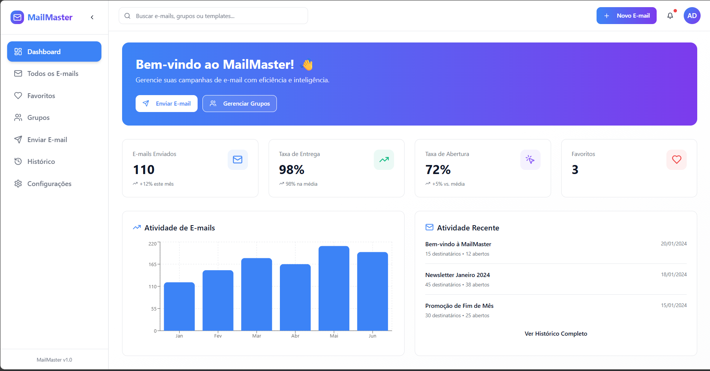
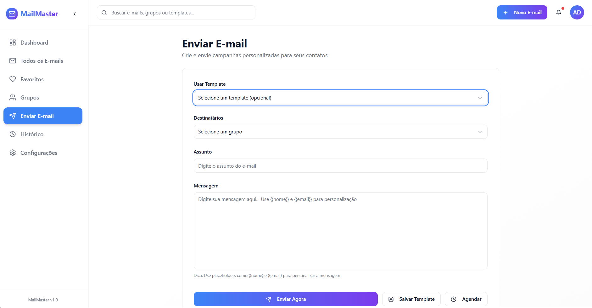
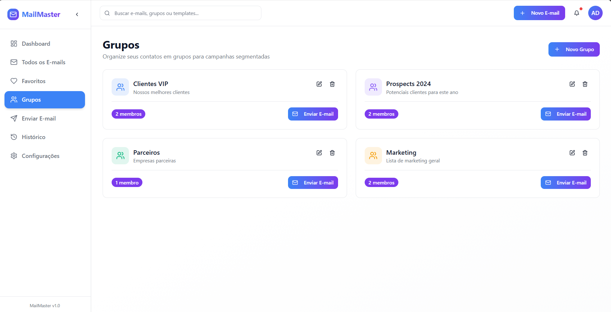
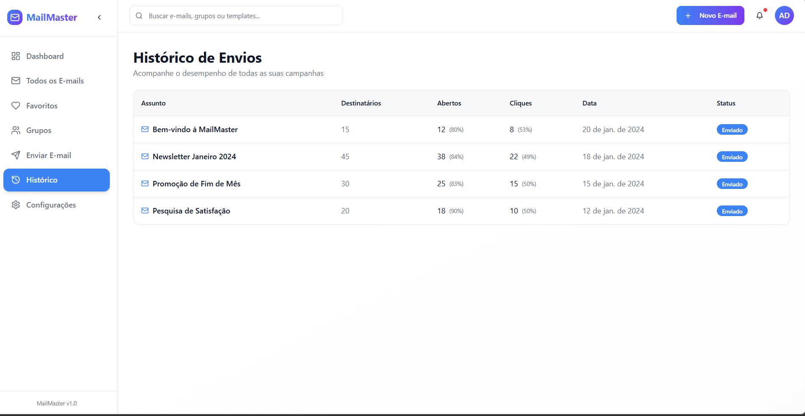

<div align="center">

# 📧 **MassMailer – Sistema Front-End de Envio de E-mails em Massa**

Interface desenvolvida em **React + TypeScript (TSX) + Vite + TailwindCSS**  
Simulação didática de envio de mensagens para múltiplos destinatários

---

### 🔧 Tecnologias


---

</div>

## 📝 Sobre o Projeto

Este projeto é uma interface front-end que **simula o envio de e-mails em massa**, criada como parte de um trabalho escolar.  
O usuário pode escrever uma mensagem, adicionar múltiplos destinatários e visualizar como seria o envio — tudo sem back-end e sem envio real de e-mails.

A aplicação foi construída com **React + TypeScript**, utilizando **Vite** para desenvolvimento rápido e **TailwindCSS** para uma interface moderna e responsiva.

---

## 📸 Demonstração da Interface

Aqui estão algumas telas principais do sistema.  
Basta substituir os nomes das imagens pelos arquivos que você colocou em **/public**.

### 🟦 Dashboard

<p align="center">
  
</p>

### 🟩 Enviar E-mail

<p align="center">
  
</p>

### 🟨 Grupos de Contatos

<p align="center">
  
</p>

### 🟧 Histórico de Envios

<p align="center">
  
</p>

### 🟥 Lista de Todos os E-mails

<p align="center">
  
</p>

---

## ✨ Funcionalidades

- ➕ Adicionar múltiplos e-mails de destinatários
- 📝 Definir assunto e corpo da mensagem
- 📤 Visualização do envio simulado
- 📁 Organização por grupos
- 🕑 Histórico de mensagens
- 📱 Interface responsiva feita com Tailwind
- ⚛ Componentes construídos em **TSX**

---

## 🧭 Roadmap — Futuras Adições

O projeto deve evoluir com:

- 🚀 **API própria** para envio real de e-mails
- 🗂 Cadastro e gerenciamento avançado de contatos
- 📦 Sistema de fila e status de envio

---

## ⚠️ Limitações Atuais

- ❌ Não envia e-mails reais
- ❌ Não possui back-end
- ❌ Não armazena dados
- 🌐 Funciona apenas como demonstração visual

---

## ▶️ Como Executar o Projeto

```bash
# Clone o repositório
git clone https://github.com/SEU-USUARIO/NOME-DO-REPO.git

# Acesse o diretório
cd nome-do-projeto

# Instale as dependências
npm install

# Execute o servidor de desenvolvimento
npm run dev
```

O projeto abre geralmente em:  
`http://localhost:5173` ou `http://localhost:8080`

---

```


## 👨‍💻 Autor

Projeto desenvolvido para fins acadêmicos por **Erick Cabral**.
```
